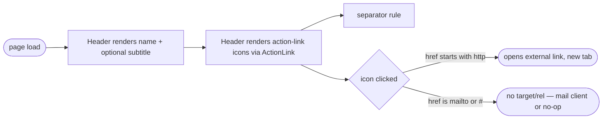

## Brainstorm

Header component underspecified in architecture.md — only "name, contact row" + generic ActionLink. Needs concrete shape before build.

Scope: name (Fraunces display), optional subtitle (role/title) below it, action-link row — email, LinkedIn, GitHub, PDF export, booking link — each an icon plus its visible label, separator rule after the links. No phone number. Props/data-driven: name, subtitle, and links passed in, nothing hardcoded.

Constraints: Must hold design-system.md palette (navy-900 name, navy-700 links) and print-safe (icons visible in `@media print`, `#theme-toggle`-style controls excluded from print already sets precedent). Page needs breathing room at the top — Layout's `<body>` was flush against the viewport edge.

## Story

As visitor, want name + contact/action-link row at top, so reach out or check profiles fast.

AC:
1. name shows large at top, optional subtitle (role/title) directly below it
2. action-link row: email, LinkedIn, GitHub, PDF export, booking link — each an icon with its visible label, no phone number anywhere
3. every action link's accessible name comes from its own visible label (no separate aria-label to keep in sync)
4. separator rule renders after the action-link row, not between name and links
5. header content passed as props, nothing hardcoded
6. PDF export icon present but inert (placeholder) — real export lands in a later spec
7. any placeholder link (href "#") stays inert, not just PDF — no dead new-tab opens
8. icons stay visible on printed page

## Design

### Flow

### Data

input: `{ name: string, subtitle?: string, links?: { label: string, href: string, icon: 'email' | 'linkedin' | 'github' | 'booking' | 'pdf' }[] }`
output: none (side effects only — external nav; `#` links are no-op placeholders)

### Modules

- `src/components/Header.astro` — new. Name (Fraunces, loaded via Google Fonts link in Layout.astro), optional subtitle line, action-link row (icon + visible label per link), separator rule after the links. Inline SVGs per icon (no icon library dep — stdlib/native, matches project's no-extra-deps stance). `links` defaults to `[]`.
- `src/components/ActionLink.astro` — new. Wraps one icon+label link; matches architecture.md's documented `ActionLink` component. `target="_blank"`/`rel="noopener noreferrer"` only when `href` starts with `http` — generic rule, not icon-specific, so any future placeholder link (not just PDF) stays inert. No `aria-label` — the visible label text is the accessible name.
- `src/layouts/Layout.astro` — loads Fraunces (700) via Google Fonts `<link>`; `<body>` gets `p-10` (breathing room) and `bg-[#FCFAF6]` (design-system.md's `paper` token — page was rendering default browser white, not the warm off-white).
- `src/pages/index.astro` — updated to new Header props (email folded into `links`, phone removed).
- `src/components/Welcome.astro` — deleted (dead file, no longer referenced after Header replaced it in index.astro).

[Header.astro](src/components/Header.astro) [Header.test.ts](src/components/Header.test.ts) [ActionLink.astro](src/components/ActionLink.astro) [Layout.astro](src/layouts/Layout.astro) [index.astro](src/pages/index.astro)

## Summary

Built `Header.astro` (name, optional subtitle, action-link row, separator) and `ActionLink.astro` (one icon+label link, generic inert-placeholder rule). Inert/external behavior keys off `href` prefix (`http` → new tab, else inert) instead of icon type, so any future placeholder link stays safe by default, not just PDF. Icons carry visible labels as their accessible name (`aria-hidden` on the SVG) instead of a separate `aria-label`. `Layout.astro` gained page padding, background, and Fraunces loading; `Welcome.astro` removed as dead code.

