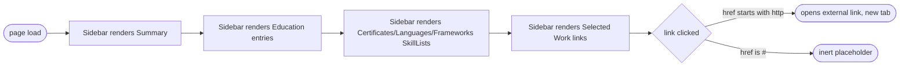

## Brainstorm

Sidebar column (right, per design-system.md two-column layout) unbuilt — only Header exists. Needs 6 sections: Summary, Languages, Frameworks, Education, Certificates, Selected Work.

Scope: `Sidebar` wrapper component (tint/border per design-system.md). Summary — `SectionLabel` + plain paragraph, no dedicated component (single text block, no repeating structure to justify one). Languages/Frameworks/Certificates — three `SkillList` instances (`years`/`caption` both optional). Education — needs richer structure (degree, institution highlighted differently, start–end dates) than `SkillList`'s label/years shape supports, so it's its own `Education` component. Selected Work — link-only list (project name + href), no description, stays scannable per sidebar's short-content rule.

Constraints: reuse existing `SkillList` (already spec'd: `{label, years?, caption?}` items, no pill/badge). No `Testimonial` (dropped earlier). Colors from registered Tailwind tokens (navy-*, ink-*, paper, wood-500), no new arbitrary hex.

## Story

As visitor, want sidebar with summary, languages, frameworks, selected work, so scan candidate's profile fast.

AC:
1. sidebar shows 6 sections in order: Summary, Education, Certificates, Languages, Frameworks, Selected Work
2. summary section: label + paragraph text, no icons/lists
3. languages section: label + caption + plain list of language/years pairs, optional smaller "side-project" line at the end
4. frameworks section: label + own caption + plain list of framework/years pairs, optional smaller "side-project" line at the end
5. education section: label + degree + institution (differentiated by weight, not color) + start–end date range, supports multiple entries
6. certificates section: label + list of cert name links (always links, `href` required per item)
7. selected work section: label + list of project name links only, no description text
8. sidebar visually separated from main column (tint/border), matches existing divider convention
9. all content passed as props, nothing hardcoded in components
10. every piece of sidebar content (Summary paragraph included) renders smaller than the section label, never equal or larger — label stays compact and is distinguished by weight/case/color, not by being the biggest element in its section

## Design

### Flow

### Data

input: `{ summary: string, languages: SkillGroup, frameworks: SkillGroup, education: EducationEntry[], certificates: SkillGroup, selectedWork: { label: string, href: string }[] }` where `SkillGroup = { caption?: string, items: { label: string, years?: number, href?: string }[], secondary?: { caption: string, items: string[] } }` and `EducationEntry = { degree: string, institution: string, startDate: string, endDate: string }`
output: none (side effects only — external nav on link clicks)

### Modules

- `src/components/Sidebar.astro` — new. `<aside>` wrapper, `bg-navy-100` tint, `divide-y divide-navy-200` between sections (border auto-skips first child, no special-casing needed). Renders Summary (label + paragraph), `Education` entries, three `SkillList`s (Certificates, Languages, Frameworks), Selected Work list — in that order.
- `src/components/Education.astro` — new. Props: `items: EducationEntry[]`. Renders `SectionLabel` + per entry: degree (`text-2xs text-ink-900`), institution (`text-2xs font-medium text-ink-900` — differentiated from degree by weight only, not color), start–end date range (`text-2xs text-ink-500`).
- `src/components/SectionLabel.astro` — new. Uppercase label, `text-xs font-semibold text-navy-700` — stays compact, distinguished from its section's content by weight/case/color, never by being the largest element. Matches architecture.md's documented component. Used by Sidebar's Summary block and by SkillList/Selected Work internally.
- `src/components/SkillList.astro` — new. Props: `label`, `caption?`, `items: {label, years?, href?}[]`, `secondary?: {caption, items: string[]}`. Renders `SectionLabel` + optional caption + item list. An item with `href` renders through `ActionLink` (link, no pill/badge); without `href`, plain text + optional `/ years` suffix. `secondary` renders an optional smaller dot-separated line below the list (e.g. "Side-project / fast ramp-up"). All content `text-2xs`.
- `src/styles/global.css` — registers `--text-2xs: 0.6875rem` in the `@theme` block — Tailwind's default scale bottoms out at `text-xs`, which is the Section label's own size, so sidebar content needs a real smaller step, not an arbitrary value sprinkled per-component.
- `src/pages/index.astro` — wire `Sidebar` into the two-column layout alongside `Header`, with real resume data (summary paragraph, education, certificates as links, languages/frameworks with years and side-project lines, selected-work links).

Reuses `ActionLink` for Selected Work and any linked `SkillList` item (Certificates) instead of a new link component — same href-prefix inert/external rule already covers "no dead new-tab" for any future placeholder link here too.
