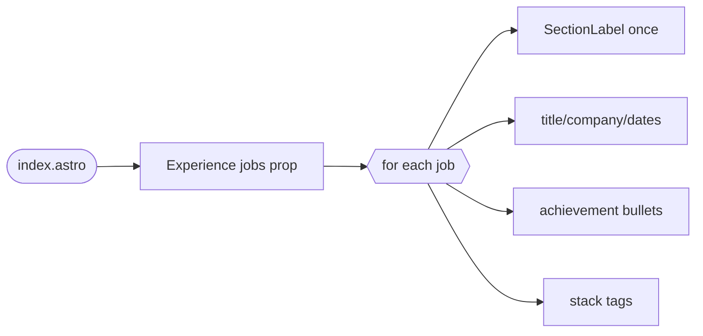

## Brainstorm

Main column (left of sidebar) empty in `src/pages/index.astro` (`<main></main>`) — Experience fills it. Reuses SectionLabel pattern from Sidebar for heading.

Per-job: title, company, location, dates, stack (tech tags), bullet list achievements. No link. Hardcoded array in Experience.astro, same pattern as Sidebar's education/languages props.

Related: [Resume Sidebar](20260915211421_resume_sidebar.md)

## Story

As visitor, want see work history, so judge candidate fit fast.

AC:

1. each job shows title, company, start-end dates
2. each job shows bullet list of achievements
3. each job shows tech stack tags, below achievements
4. jobs ordered newest first

## Design

### Flow

### Data

input: `{ jobs: { title: string, company: string, location: string, startDate: string, endDate: string, achievements: string[], stack: string[] }[] }` — dates free-form string (e.g. "2022-01", "Present")
output: rendered `<section>` in `<main>`, one entry per job, newest first (array order = display order, caller sorts)

### Modules

- `src/components/Experience.astro` — new. Renders SectionLabel("Experience") once, then per-job block: title (bold) + location right-aligned on line 1, company (bold, `navy-500`) + dates right-aligned on line 2, `<ul>` achievements (`text-sm`, body prose), stack tags row below (`text-2xs`, `·`-joined).
- `src/components/Experience.test.ts` — new. Container API render test, mirrors `Education.test.ts` pattern: asserts title/company/dates/achievements/stack text present, order preserved.
- `src/pages/index.astro` — modified. Import Experience, fill `<main>` with `<Experience jobs={[...]} />`, hardcoded array.

[Experience.astro](src/components/Experience.astro) [Experience.test.ts](src/components/Experience.test.ts) [index.astro](src/pages/index.astro)

## Summary

Built Experience.astro: renders SectionLabel + per-job title/company/location/dates/achievements/stack, hardcoded jobs array passed from index.astro. Title+company bold, company navy-500; achievements text-sm (main-column body prose), meta rows text-2xs — matches design-system typography scale, not text-xs (reserved for SectionLabel). Order not sorted by component — caller passes array in display order.
