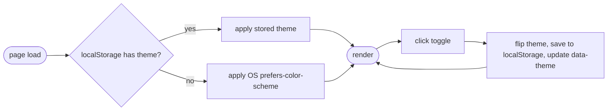

## Brainstorm

Design-system.md already defines dark-mode color tokens (`navy-900-dark`, etc) but no toggle wired up — site only follows OS preference passively today. Add explicit toggle.

Fixed corner button, independent of Header. Defaults to `prefers-color-scheme`, user choice overrides and persists via `localStorage`. Vanilla JS/CSS — no framework/island needed (per earlier discussion), just inline script + `data-theme` attr on `<html>`.

## Story

As visitor, want toggle dark/light mode, so read comfortably in own preferred lighting.

AC:

1. corner button visible on every page, fixed position
2. click switches theme immediately, no reload
3. first visit matches OS light/dark setting
4. choice persists on return visit, overrides OS setting
5. button icon/state reflects current theme

## Design

### Flow

### Data

state: `document.documentElement.dataset.theme` = `"light" | "dark"`, mirrored in `localStorage["theme"]`
no server props — client-only, no Astro component input

### Modules

- `src/styles/global.css` — modified. Add unlayered (non-`@theme`) CSS custom-property overrides for `navy-900`, `navy-700`, `navy-500`, `navy-200`, `navy-100`, `ink-900`, `ink-500`, `paper` under `@media (prefers-color-scheme: dark) { :root:not([data-theme="light"]) {...} }` and `:root[data-theme="dark"] {...}`, values from design-system.md dark table. Unlayered rules beat Tailwind's `@theme`-layer vars regardless of order, so no component class changes needed — existing `text-navy-900` etc. utilities repaint automatically.
- `src/components/ThemeToggle.astro` — new. Fixed-position (`fixed top-4 right-4`) icon button. Trusts `Layout.astro`'s head script for initial theme (no re-detection); inline `<script>` only syncs `aria-label`/icon to current `dataset.theme` on load, and on click flips value + persists to `localStorage` (try/catch — private-mode storage may throw).
- `src/components/ThemeToggle.test.ts` — new. Container API render test: button present, has `aria-label`, icon markup present, script tag present, source persists via `localStorage`.
- `src/layouts/Layout.astro` — modified. Mount `<ThemeToggle />`. Add small blocking inline `<script>` in `<head>` (before body paint) applying stored/OS theme early (try/catch around `localStorage`), avoiding flash of wrong theme — sole owner of initial theme detection.

[design-system.md](docs/design-system.md) [global.css](src/styles/global.css) [ThemeToggle.astro](src/components/ThemeToggle.astro) [ThemeToggle.test.ts](src/components/ThemeToggle.test.ts) [Layout.astro](src/layouts/Layout.astro)

## Summary

Built ThemeToggle.astro (fixed top-right icon button) + Layout.astro head script owning initial theme detection (localStorage → OS `prefers-color-scheme` fallback), no FOUC. Dark palette wired as unlayered CSS custom-property overrides in global.css — beats Tailwind's `@theme`-layer vars by cascade-layer priority, so existing `text-navy-900` etc. utilities repaint automatically, zero component class changes needed. Theme detection lives only in Layout's head script; ThemeToggle trusts the already-set `dataset.theme` rather than re-detecting, avoiding duplicated logic. `localStorage` calls wrapped in try/catch — private-mode storage failures degrade to in-memory-only instead of breaking the toggle.
