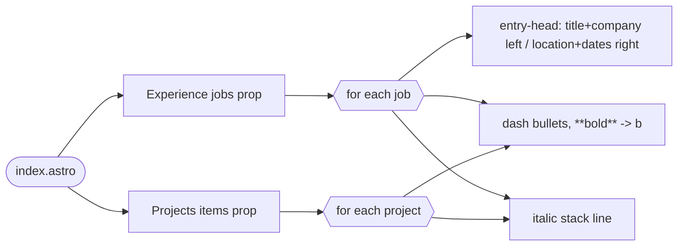

## Brainstorm

Current Experience.astro (`<ul>` disc bullets, two-row title/location + company/dates) diverges from reference prototype (em-dash `
` bullets, bold inline spans, single-row entry-head split title+subtitle left / location+dates right, italic trailing "Stack:" line). Restyle to match. Also matches original architecture.md Entry description, abandoned at build time.

Add Personal Projects section: same entry style, no location/dates/subtitle — just title, bullets, stack line.

Related: [Experience Section](20260916204423_experience_section.md)

## Story

As visitor, want experience styled like final design plus a projects section, so page reads polished and shows side work too.

AC:
1. each job entry: title+company stacked left, location+dates stacked right, same row
2. achievement bullets show as dash-prefixed lines, not disc list
3. bullets support bold inline emphasis on key results
4. stack line sits below bullets, separated by extra spacing, italic
5. personal projects section below experience, own label
6. project entry: title, bullets, stack line — no company/location/dates row
7. projects render in order given

## Design

### Flow

### Data

`Job` gains no new fields. Achievement strings support `**bold**` markdown-lite syntax, escaped then converted to `<b>` at render time (no library — dev-authored strings only, small helper function).

input (Experience, unchanged): `{ jobs: { title, company, location, startDate, endDate, achievements: string[], stack: string[] }[] }`
input (Projects, new): `{ items: { title: string, achievements: string[], stack: string[] }[] }`

### Modules

- `src/components/bullet.ts` — new. `renderBullet(text: string): string` — HTML-escape, then replace `**x**` with `<b>x</b>`. Shared by Experience + Projects (via `EntryBody`).
- `src/components/bullet.test.ts` — new. Escaping + bold conversion unit tests.
- `src/components/EntryBody.astro` — new (added during review, DRY fix). Shared achievements+stack markup — dash-prefixed `
` bullets via `renderBullet`, italic trailing stack line. Props: `{ achievements: string[], stack: string[] }`. Used by both Experience and Projects, avoids duplicating the identical render block.
- `src/components/Experience.astro` — modified. Entry-head: two-column flex, left column stacks title (bold, `text-sm`) + company (`navy-500`, `font-medium`, no longer bold-per-earlier-change) on top of each other; right column stacks location + dates (`text-2xs`, `ink-500`, right-aligned). Body delegated to `<EntryBody />`.
- `src/components/Experience.test.ts` — modified. Assert dash-bullet markup (no `<ul>`/`<li>`), bold span present for `**x**` input, entry-head left/right split.
- `src/components/Projects.astro` — new. Entry-head is title only (bold, `text-sm`), no company/location/dates row. Body delegated to `<EntryBody />`.
- `src/components/Projects.test.ts` — new. Container API test: title, bullets, bold span, stack line present; no location/date markup.
- `src/pages/index.astro` — modified. Add `<Projects items={[...]} />` below `<Experience />` in `<main>`, hardcoded array (reuse SCIM Bridge data currently sitting unlinked in Sidebar's `selectedWork`). `<main>` gets `divide-y divide-navy-100` (design-system's documented main-column section divider, previously unimplemented since Experience was the only main-column section).

[bullet.ts](src/components/bullet.ts) [bullet.test.ts](src/components/bullet.test.ts) [EntryBody.astro](src/components/EntryBody.astro) [Experience.astro](src/components/Experience.astro) [Experience.test.ts](src/components/Experience.test.ts) [Projects.astro](src/components/Projects.astro) [Projects.test.ts](src/components/Projects.test.ts) [index.astro](src/pages/index.astro)

## Summary

Restyled Experience to match reference design: entry-head splits title+company (left) from location+dates (right), bullets are dash-prefixed paragraphs (not `<ul>`) with `**bold**`-markdown-lite inline emphasis via `renderBullet()`, stack line sits italic below with extra spacing. Added Projects.astro (same entry style, no company/location/dates row) with a live SCIM Bridge entry. Extracted `EntryBody.astro` during review to remove exact duplication between Experience and Projects' achievement/stack rendering. `<main>` gained `divide-y divide-navy-100`, implementing design-system's previously-unbuilt main-column section-divider rule now that two sections share the column.