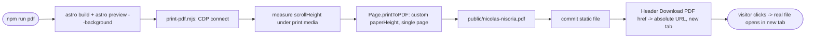

## Brainstorm

Header's "Download PDF" link (`ActionLink` icon: `pdf`) is inert (`href="#"`) — placeholder from Header spec, real export deferred. Static Astro site, no server/adapter — dynamic PDF generation needs a headless-browser dep this project doesn't have. Pre-generate a static PDF locally, commit to `public/`, wire the link to it. `@media print` light-palette override also missing (found during design-system cleanup) — print/PDF currently follows whatever theme is active on screen, not guaranteed light.

Related: [Resume Header Section](20260915190916_resume_header_section.md)

## Story

As visitor, want download resume as PDF, so keep offline copy.

AC:

1. click "Download PDF" opens/downloads real PDF, not placeholder
2. PDF content matches page content (single page, all sections)
3. PDF always renders light palette, regardless of viewer's active theme
4. printing the live page (not just the button) also forces light palette

## Design

### Flow

### Data

No runtime data model. Static asset (`public/nicolas-nisoria.pdf`) + an absolute href built from `site`/`base` config + CSS-only print override. No server/API involved.

### Modules

- `src/styles/global.css` — modified. `@media print` block resetting every `--color-*` custom property to its light value on `:root` with `!important` (beats `:root[data-theme="dark"]` regardless of active theme); `body { background: none !important }` so print output isn't tinted by the `paper` background.
- `src/components/ThemeToggle.astro` — modified. `@media print { #theme-toggle { display: none; } }` — a UI control has no business in printed/PDF output.
- `astro.config.mjs` — modified. `site: "https://niconisoria.github.io"`, `base: "/resume"` (GitHub Pages project-page deployment) — needed to build a real absolute URL and to route correctly once deployed.
- `src/lib/base.ts` — new. `withBase(path)`: normalizes `import.meta.env.BASE_URL` (never has a trailing slash) before joining a path — shared by `Layout.astro` (favicon hrefs, which `base` would otherwise break) and `index.astro` (PDF href).
- `src/pages/index.astro` — modified. Header's `links` array: `{ href: "#", icon: "pdf" }` → absolute `pdfHref` (`new URL(withBase("nicolas-nisoria.pdf"), import.meta.env.SITE)`), `newTab: true` — so the link still resolves correctly if the PDF is downloaded and opened standalone.
- `src/components/ActionLink.astro` / `src/components/Header.astro` — modified. `ActionLink` gained an optional `newTab` prop overriding its `http`-prefix heuristic (same-origin links can still force a new tab); `Header`'s `Link` type/pass-through updated to carry it.
- `scripts/generate-pdf.sh` — new. Builds the static site, runs `astro preview --background` under the `/resume/` base path, waits for readiness (explicit failure if it never comes up), calls `print-pdf.mjs`, always stops the preview server via `astro preview stop` (its own daemon, not a plain child process).
- `scripts/print-pdf.mjs` — new. Chrome DevTools Protocol script: launches headless Chrome, emulates print media + a fixed content width before measuring `scrollHeight` (must match the actual print-time layout, and use a small measurement viewport height since `body`'s `min-h-screen` would otherwise make the measurement circular), then calls `Page.printToPDF` with a computed `paperHeight` (single continuous page, no page breaks) and small margins. `send()` rejects on CDP error responses instead of silently returning malformed results.
- `test/pages/index.test.ts` — new (moved out of `src/pages/` — Astro treats any `.ts` file there as a route, which broke `astro build`). Container API test: Download PDF anchor is an absolute `https://` URL ending in the right filename, not `#`; opens in a new tab.

[global.css](src/styles/global.css) [ThemeToggle.astro](src/components/ThemeToggle.astro) [astro.config.mjs](astro.config.mjs) [base.ts](src/lib/base.ts) [index.astro](src/pages/index.astro) [ActionLink.astro](src/components/ActionLink.astro) [Header.astro](src/components/Header.astro) [generate-pdf.sh](scripts/generate-pdf.sh) [print-pdf.mjs](scripts/print-pdf.mjs) [index.test.ts](test/pages/index.test.ts) [nicolas-nisoria.pdf](public/nicolas-nisoria.pdf)

## Summary

Wired Header's "Download PDF" to a real, absolute file URL (opens in a new tab), pre-generated by `scripts/print-pdf.mjs` via the Chrome DevTools Protocol — single continuous page sized to actual content (no arbitrary page breaks), small margins, always light palette regardless of viewer theme. Set `site`/`base` in `astro.config.mjs` for GitHub Pages project-page deployment, which required fixing favicon hrefs and building a `withBase()` helper to avoid a missing-separator bug in base-path concatenation. Caught and fixed an unrelated build-breaking bug along the way: a `.ts` file under `src/pages/` gets treated as a route by Astro, crashing `astro build` — moved the page test to `test/pages/`.
