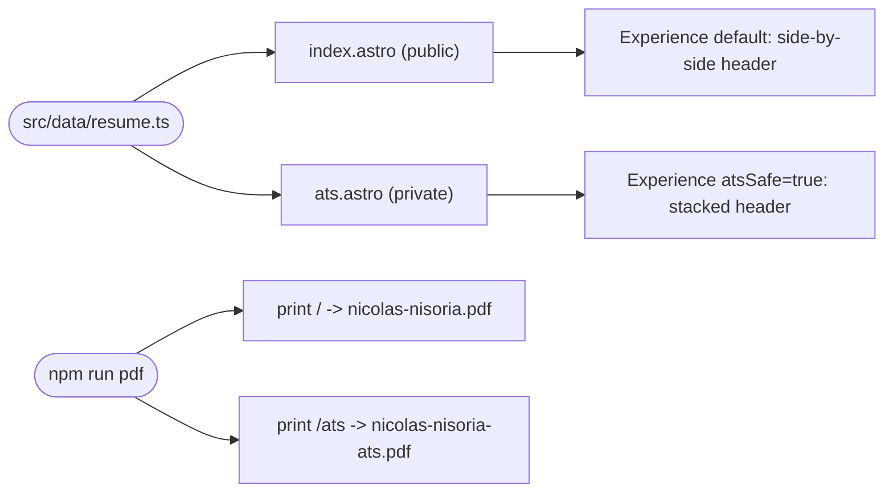

## Brainstorm

Workday-style ATS parsers mis-order job header text (title before company, per [20260916204423_experience_section.md](20260916204423_experience_section.md)'s flex layout) when reading the generated PDF. Fix already tried and reverted from the general PDF — it should stay matching the site's visual layout, not warp for ATS. Need separate `/ats` route + its own PDF: same content, same look as the public resume, only the Experience job-header order/stacking differs (ATS-safe there, side-by-side everywhere else). Own dedicated PDF file, not the public `nicolas-nisoria.pdf` — private, for niconisoria's own application use, not linked from site nav. Job/education/skills data currently hardcoded inline in `src/pages/index.astro` — needs extracting to a shared module so `/ats` reuses it instead of duplicating.

Related: [PDF Export](20260916234901_pdf_export.md), [Experience Section](20260916204423_experience_section.md)

## Story

As niconisoria, want private `/ats` page + own PDF, so paste/upload into Workday forms without title/company order breaking.

AC:

1. `/ats` page not linked from site nav, reachable by direct URL only
2. page shows same content, same look as public resume
3. Experience job header on this page/PDF only: title, company, location, dates in ATS-safe order — public PDF untouched
4. page has own download link to its own PDF file, separate from public `nicolas-nisoria.pdf`
5. editing a job/edu/skill entry updates both pages, no duplicate data to maintain

## Design

### Flow

### Data

`src/data/resume.ts` exports: `name`, `subtitle`, `summary`, `headerLinks` (contact/social/booking links, no PDF entry — each page adds its own), `jobs: Job[]`, `personalProjects`, `sidebar: { certificates, education, languages, frameworks, selectedWork }`.

`Experience.astro` gains `atsSafe?: boolean` (default `false`) — swaps the job-header row from `flex justify-between` (title+company vs. location+dates, side by side) to a single stacked column (title, company, location, dates, one per line). Same DOM order either way — Chrome's PDF text extraction reads by Y-position, so only the visual stacking (not markup order) fixes the ATS parse.

### Modules

- `src/data/resume.ts` — new. All job/education/skills/summary/header-link data, extracted from `index.astro`.
- `src/pages/index.astro` — modified. Imports `resumeData` instead of inlining it; unchanged rendering/layout; keeps its own "Download PDF" link (`nicolas-nisoria.pdf`).
- `src/pages/ats.astro` — new. Same components/layout as `index.astro`, same `resumeData`; passes `atsSafe` to `Experience`; own header link "Download PDF" pointing at `nicolas-nisoria-ats.pdf`. Not referenced from `index.astro` or `Header` anywhere — direct-URL only.
- `src/components/Experience.astro` — modified. `atsSafe` prop toggles the job-header layout classes.
- `scripts/generate-pdf.sh` — modified. Same build + single preview server; prints both `/` → `nicolas-nisoria.pdf` and `/ats` → `nicolas-nisoria-ats.pdf`.
- `src/components/Experience.test.ts` — modified. New case: `atsSafe` renders stacked-layout classes; default renders side-by-side.
- `test/pages/ats.test.ts` — new. Container API test: page renders same content as index; Experience section reflects `atsSafe` layout; download link resolves to `nicolas-nisoria-ats.pdf`.

[resume.ts](../../src/data/resume.ts) [ResumeBody.astro](../../src/components/ResumeBody.astro) [index.astro](../../src/pages/index.astro) [ats.astro](../../src/pages/ats.astro) [Experience.astro](../../src/components/Experience.astro) [Experience.test.ts](../../src/components/Experience.test.ts) [ats.test.ts](../../test/pages/ats.test.ts) [generate-pdf.sh](../../scripts/generate-pdf.sh) [nicolas-nisoria.pdf](../../public/nicolas-nisoria.pdf) [nicolas-nisoria-ats.pdf](../../public/nicolas-nisoria-ats.pdf)

## Summary

Built private `/ats` route mirroring the public resume, differing only in Experience job-header layout: side-by-side (public) vs stacked single-column (ATS), fixing Workday's title/company/date misread without touching the public PDF's look. Extracted all resume content (jobs, education, skills, summary, header links) from `index.astro` into `src/data/resume.ts`, single source both pages import. Review round caught the two pages duplicating the entire body markup (Header/Summary/Experience/Projects/Sidebar) with only 3 varying values — factored into `ResumeBody.astro`, both pages now a few lines each. `generate-pdf.sh` prints both routes in one preview session into separate PDF files.
