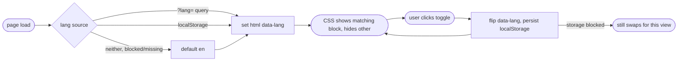

## Brainstorm

All resume text (summary, experience bullets, sidebar labels, all section content) needs EN + PL versions. Toggle button near theme-toggle switches EN/PL, persists via localStorage same pattern as theme.

Scope: whole page, both `/` and `/ats` routes, main + ATS PDFs — up to 4 PDFs total (public EN, public PL, ATS EN, ATS PL).

Constraints: existing resume data lives in `src/data/resume.ts` (single-language strings today) — needs per-field EN/PL pairs or parallel data sets. PDF gen script (`scripts/generate-pdf.sh`) currently builds 2 PDFs, needs param/loop for language.

## Story

As visitor, want toggle CV language EN/PL, so read in preferred language.

AC:

1. toggle button near theme-toggle switches whole page EN <-> PL
2. choice persists across reload (localStorage)
3. `/ats` page respects same language choice
4. downloadable PDF matches page's current language, both EN and PL PDFs available for public and ATS variants

## Design

Same pattern as `ThemeToggle`: both language blocks render server-side, CSS shows/hides by `data-lang` on `<html>`, inline head script sets it before paint (query param > localStorage > default `en`) so no flash/reload. `ResumeBody` renders twice per page (en/pl), each wrapped `data-lang="en|pl"`, each with its own `pdfHref`. Print script hits `?lang=pl` URL variant to force a deterministic language for PDF capture (mirrors how `/ats` is its own URL).

### Flow

### Data

`ResumeData` (existing `Job`/`PersonalProject`/sidebar shapes, unchanged) — split into two full datasets:
input: `getResumeData(lang: "en" | "pl")`
output: `ResumeData` (same shape as today's `resume.ts` exports)

`labels.ts`: `{ en: { summary: string, downloadPdf: string, switchLang: string }, pl: {...} }` — UI microcopy not part of resume content.

### Modules

- `src/data/resume.types.ts` — new, shared interfaces extracted from current `resume.ts`
- `src/data/resume.en.ts` — new, today's English content moved here as-is
- `src/data/resume.pl.ts` — new, Polish translation, same shape
- `src/data/resume.ts` — modified, becomes `getResumeData(lang)` selector + type re-exports
- `src/data/labels.ts` — new, EN/PL UI microcopy (section labels, "Download PDF", toggle aria-label)
- `src/components/LangToggle.astro` — new, mirrors `ThemeToggle.astro` (button, inline script, localStorage `lang` key)
- `src/components/LangToggle.test.ts` — new, mirrors `ThemeToggle.test.ts`
- `src/components/ResumeBody.astro` — modified, add `lang` prop, wrap output `data-lang={lang}`, pull data via `getResumeData(lang)` + `labels[lang]`
- `src/layouts/Layout.astro` — modified, inline head script also resolves `lang` (query param → localStorage → `en`), sets `html[data-lang]`, renders `<LangToggle />`
- `src/pages/index.astro` — modified, renders `ResumeBody` twice (en/pl), separate `pdfHref` each
- `src/pages/ats.astro` — modified, same, twice with ATS `pdfHref`s
- `scripts/generate-pdf.sh` — modified, 4 `print-pdf.mjs` calls (public/ATS × en/pl, `?lang=pl` query variant), 4 output filenames (`nicolas-nisoria.pdf`, `nicolas-nisoria-pl.pdf`, `nicolas-nisoria-ats.pdf`, `nicolas-nisoria-ats-pl.pdf`)

[resume.types.ts](src/data/resume.types.ts) [resume.en.ts](src/data/resume.en.ts) [resume.pl.ts](src/data/resume.pl.ts) [resume.ts](src/data/resume.ts) [resume.test.ts](src/data/resume.test.ts) [labels.ts](src/data/labels.ts) [LangToggle.astro](src/components/LangToggle.astro) [LangToggle.test.ts](src/components/LangToggle.test.ts) [ResumeBody.astro](src/components/ResumeBody.astro) [Experience.astro](src/components/Experience.astro) [Projects.astro](src/components/Projects.astro) [EntryBody.astro](src/components/EntryBody.astro) [Education.astro](src/components/Education.astro) [Sidebar.astro](src/components/Sidebar.astro) [Layout.astro](src/layouts/Layout.astro) [index.astro](src/pages/index.astro) [ats.astro](src/pages/ats.astro) [index.test.ts](test/pages/index.test.ts) [ats.test.ts](test/pages/ats.test.ts) [generate-pdf.sh](scripts/generate-pdf.sh) [nicolas-nisoria-pl.pdf](public/nicolas-nisoria-pl.pdf) [nicolas-nisoria-ats-pl.pdf](public/nicolas-nisoria-ats-pl.pdf)

## Summary

EN/PL CV toggle built: resume data split into two same-shape datasets behind `getResumeData(lang)`, UI microcopy in `labels.ts`. Both languages server-render per page, CSS shows block matching `html[data-lang]`, set pre-paint by head script (query > localStorage > `en`) — no flash, no reload, `/ats` shares choice via same key. `generate-pdf.sh` prints 4 PDFs via `?lang=pl` variant; each block links its own PDF. Each block carries own `lang` attr for screen readers.
